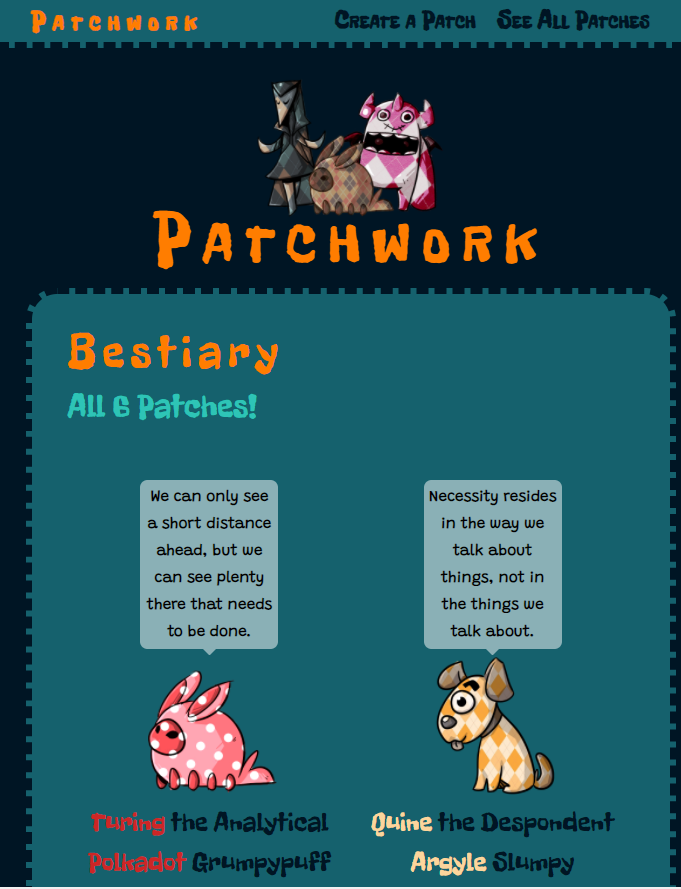
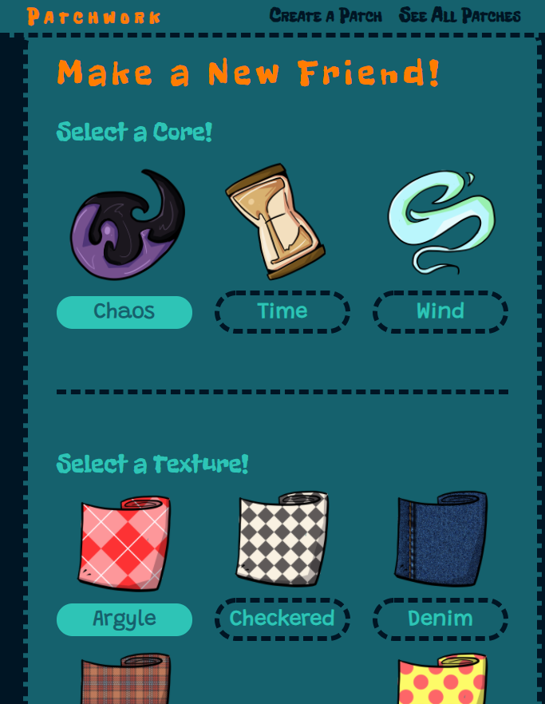
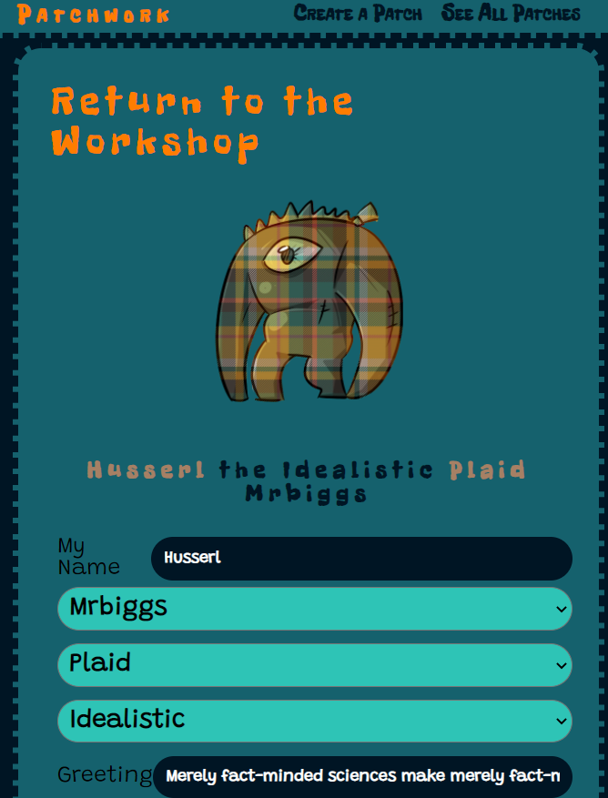

# PATCHWORK

### Front End (React)

#### [Patchwork Back End](https://github.com/themarkfullton/patchwork-back-end) (Java + Spring; MongoDB)

**LINK TO LIVE:** https://patchwork-friends.herokuapp.com/

Full Stack. Virtual Pet game meets Frankenstein. Create your own doll companions and fight a faceless evil. Still under construction, but you can still create, edit, and delete "patches" (pets).

## Technologies Used

React, Sass, Axios (to connect with Java/Spring API)

## Motivation

Virtual Pet games used to be all the rage and I was curious to figure out how they might work since there are so many moving parts. I was especially curious to see what a modern React rendition might look like, seeing as the design might benefit from it.

## Future Plans

This is still under construction. Still need to add authentication, items, exploration, battle, random events, and unlockable textures/patterns.

## Screenshots

